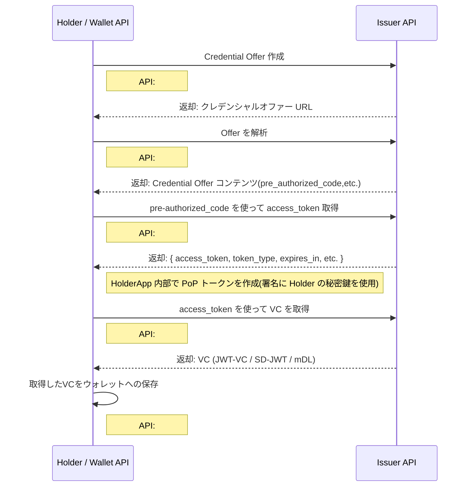

```mermaid
sequenceDiagram
    participant HolderApp as Holder / Wallet API
    participant IssuerAPI as Issuer API

    %% 1. Credential Offer 作成
    HolderApp->>IssuerAPI: Credential Offer 作成
    Note right of HolderApp: API:
    IssuerAPI-->>HolderApp: 返却: クレデンシャルオファー URL

    %% 2. Offer を解析
    HolderApp->>IssuerAPI:  Offer を解析
    Note right of HolderApp: API:
    IssuerAPI-->>HolderApp: 返却: Credential Offer コンテンツ(pre_authorized_code,etc.)

    %% 3. pre-authorized_code を使って access_token 取得
    HolderApp->>IssuerAPI: pre-authorized_code を使って access_token 取得
    Note right of HolderApp: API:
    IssuerAPI-->>HolderApp: 返却: { access_token, token_type, expires_in, etc. }

    %% 4. Holder の秘密鍵から PoP (Proof-of-Possession) 用 JWT/CWT を生成
    Note right of HolderApp: HolderApp 内部で PoP トークンを作成(署名に Holder の秘密鍵を使用)

    %% 5. access_token を使って VC を取得
    HolderApp->>IssuerAPI: access_token を使って VC を取得
    Note right of HolderApp: API:
    IssuerAPI-->>HolderApp: 返却: VC (JWT-VC / SD-JWT / mDL)

    %% 6. Holder Wallet への保存
    HolderApp->>HolderApp: 取得したVCをウォレットへの保存
    Note right of HolderApp: API:


```
